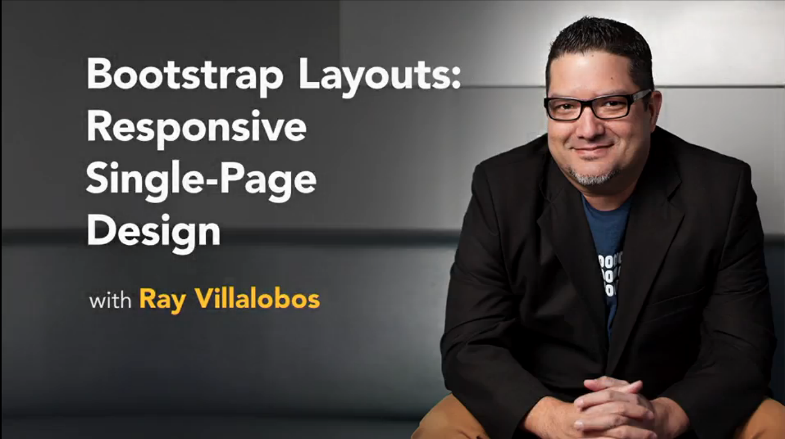

# Bootstrap Layouts: Responsive Design
Repository for my Course on Bootstrap Layouts focusing on Responsive Design.

This is the repository for my course, [Building a Data-Driven App with AngularJS](http://www.lynda.com/Bootstrap-tutorials/Bootstrap-Layouts-Responsive-Single-Page-Design/186538-2.html). The full course is available at [lynda.com](http://lynda.com).
- [Demo Website](http://iviewsource.com/exercises/responsivebootstrap)
- [My Personal Website](http://raybo.org)

## Course Description
Find out how Bootstrap can transform your standard HTML websites into inspired single-page designs. This course is a project-based approach to learning how to manipulate website layouts with the Bootstrap framework. Staff author Ray Villalobos tackles Bootstrap's layout classes, like containers, rows, and columns, and shows what it takes to customize Bootstrap's CSS and address layout challenges like multiple grids and columns. Plus, learn how to track navigation as users scroll, with the ScrollSpy plugin, and create a full-screen, responsive image carousel.

## Topics include:
- Analyzing your markup
- Creating simple column layouts
- Creating basic navigation and a simple carousel
- Modifying Bootstrap styles
- Working with branding and toggle styles
- Adding interactivity

## Instructions
This repository has branches for each of the videos in the course. You can use the branch pop up menu in github to switch to a specific branch and take a look at the course at that stage. Or you can simply add `/tree/BRANCH_NAME` to the URL to go to the branch you want to peek at.

1. Make sure you have these installed
	- [node.js](http://nodejs.org/)
	- [git](http://git-scm.com/)
	- [gulp](http://gulpjs.com/)
2. Clone this repository into your local machine using the terminal (mac) or Gitbash (PC) `> git clone https://github.com/planetoftheweb/attendance.git`
3. CD to the folder `cd bootcarousel`
4. Run `> npm-install` to install the project dependencies
5. Install gulp.js via the Mac terminal or Gitbash on a PC `> npm install -g gulp`
5. Run the Gulp command `> gulp`

For more help setting up a comprehensive Gulp.js workflow, check out [Web Project Workflows with Gulp.js, Git, and Browserify](http://www.lynda.com/Web-Web-Design-tutorials/Web-Project-Workflows-Gulpjs-Git-Browserify/154416-2.html).

## More Stuff
Check out some of my [other courses on lynda.com](http://lynda.com/rayvillalobos). You can also check out my [youtube channel](http://youtube.com/planetoftheweb), [follow me on twitter](http://twitter.com/planetoftheweb), or read [my blog](http://raybo.org).

## No Images
__Warning:__ These files contain no images, but you can use your own images or use a placeholder website like [placehold.it](http://placehold.it/).
